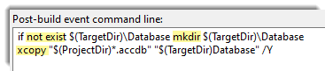

# About
When a VB.NET project (same can be easily done in C# also) requires a file or database to replace when missing, or never existed, the common idea is to create the database at runtime. Creating a database means extra libraries will be needed along with the possibility of failure. Rather than do this at runtime this repository offers an alternate method which is to place a safe copy of a database in a sub folder of the application, when needed copy to the application folder. A key aspect of this method involves several items to be in place which are discussed in an upcoming TechNet article.

[Microsoft TechNet article](https://social.technet.microsoft.com/wiki/contents/articles/53901.copy-files-post-build-in-visual-studio.aspx)

- Will work with any file type
- Leaves off where copy to output folder ends



```
FileHelper.CopyDatabase(True)

If Not FileHelper.IsSuccessFul Then
    If FileHelper.DatbaseInuse Then
        MessageBox.Show("Please close the database and try again")
    Else
        MessageBox.Show(FileHelper.LastExceptionMessage)
    End If
Else
```